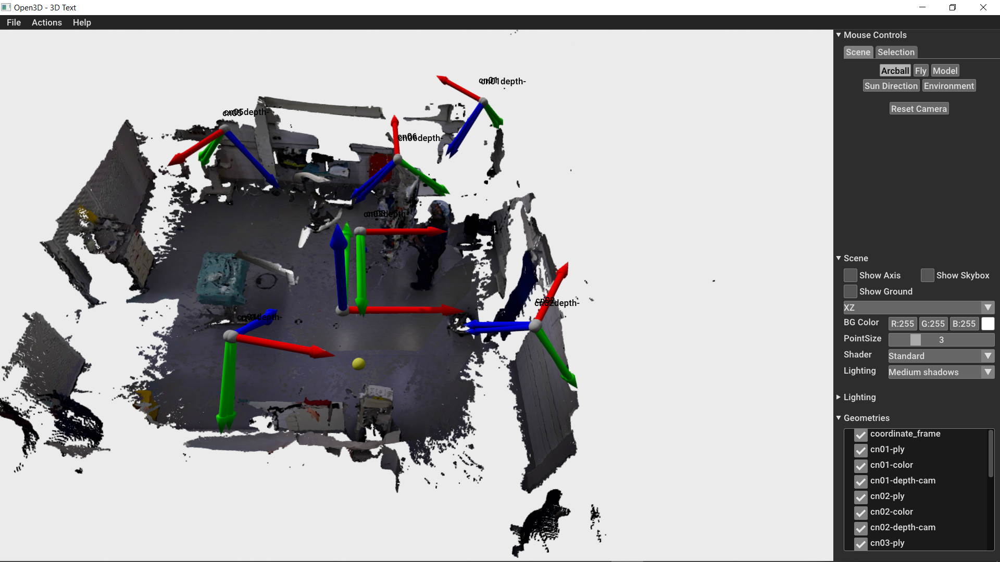
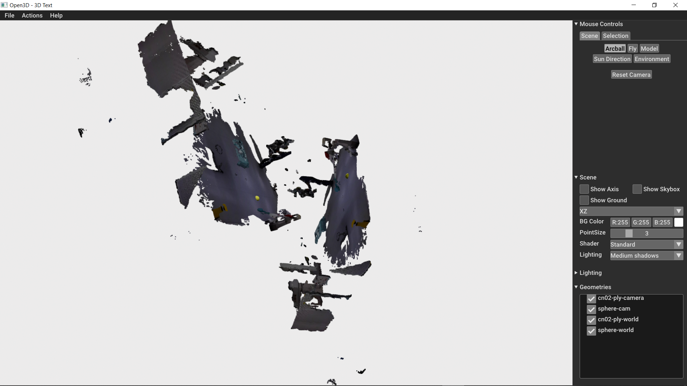
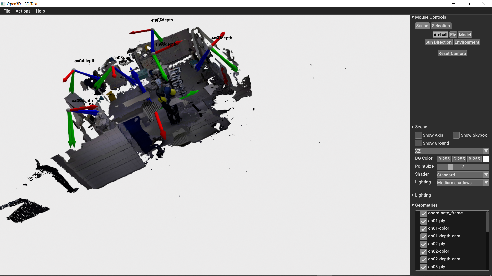

# Background Knowledge

[Here](https://drive.google.com/drive/folders/1zOnaYQDOdhqWjW9ccykS4i8NwtDBUlTk?usp=sharing) is some useful material that you can use in order to understand the mathematics behind this project.
[Here](https://www.youtube.com/watch?v=RDkwklFGMfo&list=PLTBdjV_4f-EJn6udZ34tht9EVIW7lbeo4&ab_channel=cvprtum) are youtube videos from the Multiple View Geometry Course - Lectures 2 to 5 are explaining everything that is needed for this project.  

# Key concepts

Perspective projection - how to project a world point (3D) onto the image plane (2D)

Intrinsics of a camera - parameters that are camera dependent. These include the focal length, the principle point, the skew and the scale offset. 

Extrinsics of a camera - how the camera moves in reference to the world. Keep in mind that the world as well as the camera have their own coordinate systems. So, we need a way to describe the relationship between these two coordinate frames. Since the camera is a rigid body - it can only rotate and translate, rotation and translation of the camera are used as the extrinsic parameters that describe how the camera is positioned w.r.t. the world.

World point - a 3D point from the scene that we are capturing 

Point in camera coordinates - a 3D world point in the coordinate system of the camera

Pixel - a 2D point in the image 

# Key equation to understand
λx = K * (RX + T)

where:

X = (X1, Y1, Z1), a world point 

R = Rotation matrix

T = Translation vector

K = Instrinsic matrix

x = (x1, y1), pixel coordinates in the image

λ = depth 

Rotation and translation are applied to convert a world point to the camera coordinate system. Afterwards the intrinsics are applied (K) to project the point in camera coodinates to the image plane in the correct location. We are still in camera coordinates afterwards, not in pixels. In order to get to the pixel coordinates, the perspective projection is applied.

# visualize.py

## render_camera_poses()

This is the result after running the render_camera_poses function. The yellow sphere represents a 3D world point. The world consists of the point clouds gathered from all cameras. Also, the coordinate systems from all the cameras are displayed. The blue arrow represents how the respective camera sees the scene.

## render_single_pose()

After running this function, we can see the pointcloud and the yellow sphere in two coordinate systems: the depth camera 02 coordinate system and the world coordinate system.

# visualize_3D_reprojections.py

This script provides a way to visualize 3D reprojections of corresponding pixels that represent "the center" of a person from one frame.  

